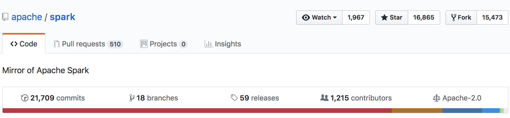
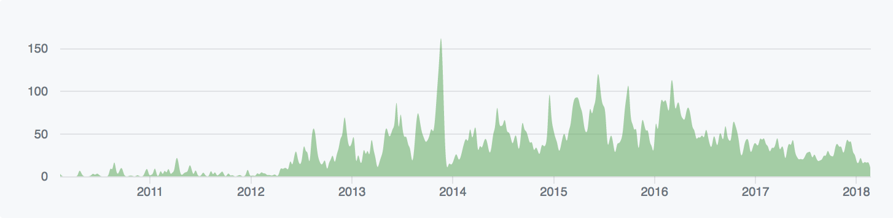
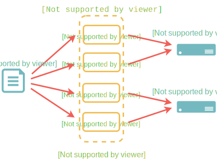
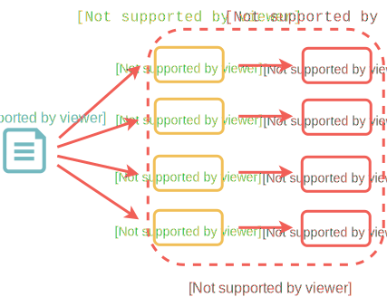
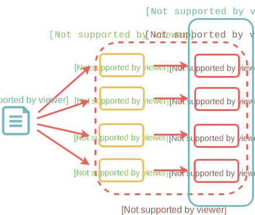
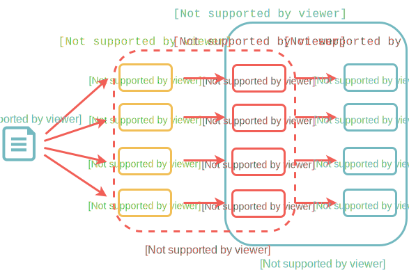

# Distributed Data Analysis and Apache Spark

#### Rok Roškar, Swiss Data Science Center, ETH Zürich

##### Cryptodatathon, Zürich, June 4, 2018


## Who am I?

* PhD in Astrophysics from University of Washington
* I currently lead the [SDSC Renku platform](https://github.com/SwissDataScienceCenter/renku) team at ETH Zürich
* Last several years spent solving big-data analysis problems within various scientific domains at ETH


## Big Data
### Everyone is talking about it... but no one knows what it is

1 Gb? 50 Gb? 500 Gb? 500 Tb? 1 Pb? <!-- .element: style="text-align:center" -->

It doesn't matter! <!-- .element: style="text-align:center;font-weight:bold" class="fragment" data-fragment-index="1"-->

* "Big data" is when you start to seriously worry that your analysis will never complete <!-- .element: class="fragment" data-fragment-index="2" -->
* this could be due to memory or runtime <!-- .element: class="fragment" data-fragment-index="2" -->
* good news: lots of people are doing it --> can't be that hard! <!-- .element: class="fragment" data-fragment-index="2" -->


## A trivial example

Lets say you want to analyze some tweets <!-- .element: class="fragment" data-fragment-index="1" -->

-> one month of 1% twitter stream data is ~ 1 TB <!-- .element: class="fragment" data-fragment-index="1" -->

How do you process this? <!-- .element: class="fragment" data-fragment-index="2" -->

-> typical computers have a few Gb of RAM <!-- .element: class="fragment" data-fragment-index="2" -->

<p>-> need *at least* 1.5 hours *just to read the data!* (200 MB/s SSD)</p> <!-- .element: class="fragment" data-fragment-index="2" -->

-> expensive servers have 100s of GBs up to 1-2 TB of RAM <!-- .element: class="fragment" data-fragment-index="2" -->

#### Using a distributed system, you can make an impossible problem solvable and reduce time-to-solution <!-- .element: class="fragment" data-fragment-index="3" -->


## "Scaling up" computatiom


<!-- .slide: data-background="figs/laptop_workstation.svg" data-background-size="contain" -->


### First try: move from laptop to a workstation

* more memory! problem solved? handled by operating system...
* more cores! special libraries can provide simple multithreading support
* still, we want analysis on Tb of data at interactive speeds!

*Obtain results* of a model within seconds of changing a parameter;

*discover relationships* in high-dimensional data by slicing, dicing, reducing, visualizing

A single workstation will not cut it, and if it does for a problem today, it certainly won't tomorrow.


<!-- .slide: data-background="figs/cluster-computing.svg" data-background-size="contain" -->


<!-- .slide: data-background="figs/cluster-computing.svg" data-background-size="contain"  data-state="background-blur-animation"-->
### Next, move to a *cluster*

* a set of interconnected servers steered through some common gateway <!-- .element: class="fragment" data-fragment-index="1" -->
* easy for "embarrasingly" parallel work-loads <!-- .element: class="fragment" data-fragment-index="1" -->
* book-keeping nightmare (tons of files, but helped with workflow managers) <!-- .element: class="fragment" data-fragment-index="1" -->
* not so easy for really parallel computation <!-- .element: class="fragment" data-fragment-index="1" -->
* definitely not easy for interactive use and data exploration <!-- .element: class="fragment" data-fragment-index="1" -->


What's so hard about distributed analysis/computation?

* data and tasks need to be *coordinated* between the different machines
* consumption of data and production of results has to be controlled
* partial results calculated on various parts of the system need to be assembled for the user
* in a "true" parallel environment, this is done via very complicated sequences of communication library calls
* no longer have one machine but many, potentially hundreds --> hard to debug/control!


## Liberation through limitation

General multiprocessing/parallel libraries (e.g. MPI)
* give the user a lot of control and flexibility
* they are *very* hard to use and debug!
* not great for fast turn-around of home-grown code!

<hr class="fragment visible" data-fragment-index="0">

<h4 class="fragment visible" data-fragment-index="0">What if we only allowed the user a very rigid programming model?</h4>

<ul style="text-align:left" class="fragment visible" data-fragment-index="0">
<li>more robust out-of-the-box</li>
<li>predictable</li>
<li>easier to monitor, discover failures etc.</li>
</ul>


<!-- .slide: data-background="figs/mapreduce.svg" data-background-size="contain" -->


<!-- .slide: data-background="figs/mapreduce.svg" data-background-size="contain" data-state="background-blur-animation"-->
#### **MapReduce** is such a programming paradigm

* not just the combination of map and reduce tasks...
* fault-tolerance (expect nodes to go down all the time)
* data replication
* data locality


### We all know this to some extent --> it's all around us

* Web 2.0 <!-- .element class="fragment" data-fragment-index="2" -->
    * multimedia content (images, video, music/audio)
    * recommendation engines (shopping, movies, ads. etc.)
* Sensors <!-- .element class="fragment" data-fragment-index="3" -->
    * smartphone
    * real-world, internet of things
* Public infrastructure <!-- .element class="fragment" data-fragment-index="4" -->
    * telecom
    * transportation (trains, traffic)
* Science <!-- .element class="fragment" data-fragment-index="5" -->
    * CERN
    * astronomy sky surveys
    * translational medicine

Many of these "production" systems based on MapReduce combined with efficient "data stores" (distributed databases etc) <!-- .element class="fragment" data-fragment-index="6" -->


<!-- .slide: data-background="figs/datacenter.svg" data-background-size="300px"  data-state="background-blur" data-background-repeat="repeat"-->
### modern data centers consist of 1000s of machines

<ul style="text-align:left" class="fragment visible" data-fragment-index="0">
<li> data movement is critical and often most expensive   </li>
<li> often, this is "commodity" hardware </li>
<li> network between machines might be sluggish </li>
<li> bring computation/algorithm to the data! </li>
</ul>


## "Big Data" software stack

* big data tools --> Hadoop ecosystem under Apache (Hadoop, Pig, Hive, Mahout, etc.)
* a whole zoo of tools for various stages of data processing
* stable, reliable, used in businesses all over the world daily (potentially with high admin cost)

<hr class="fragment visible" data-fragment-index="0">

<ul class="fragment visible" data-fragment-index="0">
<li>a pain to use, not easy to set up, requires specialized configurations</li>
<li>Hadoop handles fault tolerance by dumping all intermediate results to disk and replicating; lots of I/O at every stage</li>
<li>heavy use of Java...</li>
</ul>


<!-- .slide: data-background="http://spark.apache.org/images/spark-logo.png" data-background-size="contain" -->


## Enter... Spark

### a general-purpose distributed computation framework

* performs calculations using a directed acyclic graph (DAG) instead of strictly map and reduce stages <!-- .element class="fragment" data-fragment-index="1" -->
* DAG allows for in-memory caching and fault-tolerance without disk I/O <!-- .element class="fragment" data-fragment-index="2" -->
* does not require specialized infrastructure, can run without Hadoop/HDFS <!-- .element class="fragment" data-fragment-index="4" -->
* has a rich feature-set to make programming easier (in Scala, Java, Python, R) <!-- .element class="fragment" data-fragment-index="5" -->
* includes a machine learning library with increasingly useful features <!-- .element class="fragment" data-fragment-index="6" -->
* the most active Apache BD project <!-- .element class="fragment" data-fragment-index="7" -->
* heavy industry backing - IBM commited 3500 (!?) developers to open source effort worldwide, dozens of other companies contributing <!-- .element class="fragment" data-fragment-index="8" -->


## What is Spark?

### "a general-purpose distributed computation framework"

a few key features:

* interactive data exploration (think jupyter notebooks)
* keeps data in-memory - good for loop-intensive algorithms

where is it being used?

* internet applications (recommendation engines, log analysis etc.)
* classic Big Data use cases e.g. text analysis
* some academia, notably neuroscience


### Project stats





## Why use Spark?

Spark is just one solution that facilitates analysis on large data.

Other options:

* Use a workflow manager like [snakemake](https://snakemake.readthedocs.io/)
* using the Message Passing Interface (MPI) library
* similar frameworks e.g. [Apache Flink](https://flink.apache.org/) (more streaming-specific)
* Python-specific [Dask](https://dask.pydata.org) (nice abstraction for scaling python-native applications)

Using a distributed system introduces enormous complexity - thinking hard about your requirements and algorithms will always deliver the best results!


## Flexibility of Spark runtime

Spark's flexibility is what makes it so popular.

The spark runtime can be deployed on:
* a single machine (local)
* a set of pre-defined machines (stand-alone)
* a dedicated Hadoop-aware scheduler (YARN/Mesos )
* "cloud", e.g. Amazon EC2


## Incremental and interactive development

The development workflow is that you start small (local) and scale up to one of the other solutions, depending on your needs and resources.

In addition, you can run applications on any of these platforms either

* interactively through a shell (or a Jupyter notebook as we'll see)
* batch mode

<p style="text-align: center;"><em><strong>No code changes to go between these methods of deployment!</em></strong></p>


## Spark Architecture Overview


### The things that make distributed computing hard:

1. distributing work to the available resources
2. orchestrating task execution
3. collecting results

This is what a "framework" like Spark does for us

At its most basic, it consists of a **driver** and **workers**


<!-- .slide: data-background="figs/spark_architecture.svg" data-background-size="contain" -->


<!-- .slide: data-background="figs/spark_architecture.svg" data-background-size="contain" data-state="background-blur-animation"-->
**Driver**

* coordinates the work to be done
* keeps track of tasks
* collects metrics about the tasks (disk IO, memory, etc.)
* communicates with the workers (and the user)


<!-- .slide: data-background="figs/spark_architecture.svg" data-background-size="contain" data-state="background-blur-animation"-->
**Workers**

* receive tasks to be done from the driver
* store data in memory or on disk
* perform calculations
* return results to the driver

The user's access point to this Spark universe is the **Spark Context** which provides an interface to generate RDDs.


## Basic Data Abstraction:
## the RDD (Resilient Distributed Dataset)

<p style="text-align: center;">An RDD is the primary interface and cornerstone of every Spark application.</p>

* keeps track of data distribution across the workers <!-- .element: class="fragment" data-fragment-index="1" -->
* provides an interface to the user to access and operate on the data <!-- .element: class="fragment" data-fragment-index="1" -->
* can rebuild data upon failure <!-- .element: class="fragment" data-fragment-index="1" -->
* keeps track of lineage <!-- .element: class="fragment" data-fragment-index="1" -->
* is immutable <!-- .element: class="fragment" data-fragment-index="1" -->

<p style="text-align: center;"><strong>As a Spark user, you write applications that feed data into RDDs and subsequently transform them into something useful</strong></p>
<!-- .element: class="fragment" data-fragment-index="2" -->


<!-- .slide: data-background="figs/parallelize.svg" data-background-size="contain" -->


## RDD transformations and actions

Once an RDD is created, it is **immutable** - it can only be transformed into
a new RDD via a *transformation*.

A transformation, however, does not trigger any computation, only updates the
DAG.

Calculations are triggered by *actions*.


## Transformations

* `distinct`: only retain the unique elements of the entire RDD
* `filter`: only keep those elements for which the filter function evaluates to `True`
* `flatMap`: returns a number of items different from the original data
* `map`: the most basic transformation with 1:1 correspondence to original data
* `mapPartitions`: similar to `map` but done on a per-partition basis
  (requires a generator function)
* `reduceByKey`: group elements by key and keep the data distributed
* `sortBy`: sort using the provided function

Transformations are evaluated "lazily" - only executed once an *action* is performed.


## Actions
* `collect`: pulls all elements of the RDD to the driver (often a bad idea!!)
* `collectAsMap`: like `collect` but returns a dictionary for key/value RDDs
* `countByKey`/`countByValue`
* `first`: returns the first element of the RDD to the driver
* `reduce`: reduces the entire RDD to a single value
* `take`: yields a desired number of items to the driver


## Lineage

* When an RDD is transformed, this **transformation** is not automatically
  carried out.
* Instead, the system remembers how to get from one RDD to another and only
  executes whatever is needed for the **action** that is being done.
* this allows one to build up a complex "pipeline" and easily tweak/rerun it
  in its entirety


## PySpark

* Spark is written in Scala, but provides `Python` and `R` wrappers
* You need to be aware of the data shuffling that occurs behind the scenes!


### Initializing Spark
```python
import pyspark

sc = pyspark.SparkContext()
```

This step launches the Spark runtime and connects the application to the
master. This creates a driver which can now be used to dispatch work to the
resources allocated for the application.


### Parallelize
```python
rdd = sc.parallelize(data)
```
<p style="text-align: center;">
    
</p>


### map
```python
def square(x):
    return x*x

rdd = sc.parallelize(data)
rdd_squared = rdd.map(square)
```
<p style="text-align: center;">
    
</p>


## Caching

* RDD evalutations are *lazy*
* whenever an action is performed, the entire lineage graph is recalculated
* unless! an intermediate RDD is cached -- then it is only calculated once and reused from memory each subsequent time
* this allows for good performance when iterating on an RDD is required


```python
rdd = sc.parallelize(data)
rdd2 = rdd.map(square)
rdd2.cache()
```



```python
rdd = sc.parallelize(data)
rdd2 = rdd.map(square)
rdd2.cache()
rdd3 = rdd2.map()
```



## APIs

Two APIs: "lower"-level RDD API and the more user-friendly DataFrame API

### RDD

* construct data transformations using transformations and actions
* easily write e.g. python functions and ship them to execute on data
* difficult to optimize

### DataFrame

* the DataFrame API uses RDDs under the hood
* typed operations --> can provide optimizations in all languages
* basic but growing ML library (continuing development only for DF API)
* ideal for tabular data, familiar dataframe concept from `R`, `pandas` etc.
* can always switch to RDD for difficult/unsupported operations


## Where to go from here

* [spark documentation](http://spark.apache.org/docs/latest/)
* [configuration](http://spark.apache.org/docs/latest/configuration.html)
* [API docs](http://spark.apache.org/docs/latest/api/python/index.html)
* [ML Guide](http://spark.apache.org/docs/latest/ml-guide.html)

Run spark on your laptop using [Docker](https://www.docker.com/):

```console
$ docker run --rm -p 8888:8888 -p 4040:4040 jupyter/pyspark-notebook
```

Or try out some [tutorial notebooks](https://github.com/hopelessoptimism/data-scientists-guide-apache-spark) on mybinder.org (not tested!):

https://mybinder.org/v2/gh/hopelessoptimism/data-scientists-guide-apache-spark/master


[Five-minute Spark DataFrames demo](dataframe_demo.slides.html#/1)
